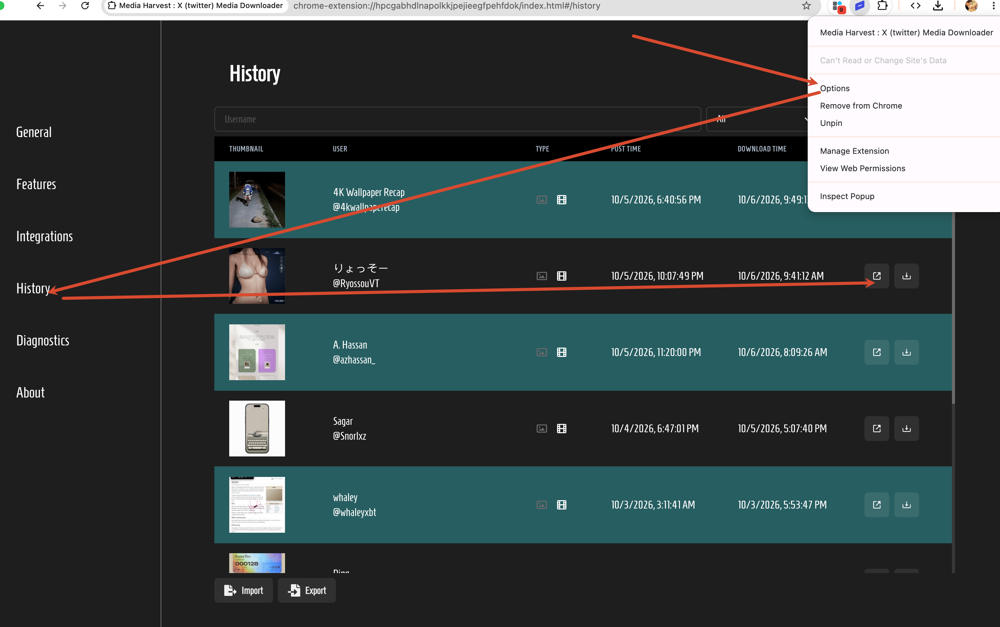

在AI时代，推特X是一手消息的发源地，独立开发者，内容创作者，都在用视频展示自己的作品，下载推特X的视频进行二次传播，也是一个实实在在的需求。

这里推荐一个开源扩展工具，可以一键下载推特X视频到本地，开源地址：https://github.com/EltonChou/TwitterMediaHarvest

使用效果：

如果想要更快传播，也可以转换为gif

## 实用功能

在历史页面，可以找到以前下载视频的出处，如果某天某个好友对你分享的小视频很感兴趣，可以从历史记录找到原帖地址，告诉他出处

## 《Media Harvest X (twitter) Media Downloader》 下载链接

<table style="table-layout: fixed;">
<tbody>
<tr>
<td>

Chrome
 

</td>
<td>

Edge
 

</td>
<td>

FireFox
 

</td>
<td>

离线安装包
 

</td>
</tr>
<tr>
<td>

<a  href="https://chromewebstore.google.com/detail/media-harvest-x-twitter-m/hpcgabhdlnapolkkjpejieegfpehfdok">下载链接 / Download link</a>

</td>
<td>

<a  href="https://greasyfork.org/zh-CN/scripts/577261-shift-translator-hover-toggle-selection-tooltip-chrome-translator-api">下载链接 / Download link</a>

</td>
<td>

<a  href="https://github.com/EltonChou/TwitterMediaHarvest/releases/download/v4.5.7/mediaharvest@mediaharvest.app-v4.5.7.xpi">下载链接 / Download link</a>

</td>
<td>

<a  href="https://cdn.jsdelivr.net/gh/zhaoolee/ChromeAppHeroes/backup/134-media-harvest-x-twitter-m.zip">下载链接 / Download link</a>

</td>
</tbody>
</table>

## 小结

在AI的加持下，大量的产品被批量造出，想要让产品抓人眼球，必须得制作好的宣传视频，而推特X上有很多经过算法筛选的优质视频，逐帧下载研究这些视频，能为产品制作带来灵感。

## 写在最后(我需要你的支持) / At the end (I need your support)

- 本文属于**Chrome插件英雄榜** 项目的一部分, 项目Github地址: [https://github.com/zhaoolee/ChromeAppHeroes](https://github.com/zhaoolee/ChromeAppHeroes)

- This article is part of the **ChromeAppHeroes** project. Github link : [https://github.com/zhaoolee/ChromeAppHeroes](https://github.com/zhaoolee/ChromeAppHeroes) 

- **Chrome插件英雄榜**, 为优秀的Chrome插件写一本中文说明书, 让Chrome插件英雄们造福人类, 如果你喜欢这个项目, 希望你能为本项目添加一颗 🌟星.

- ChromeAppHeroes, Write a Chinese manual for the excellent Chrome plugin, let the Chrome plugin heroes benefit the human, If you like this project, I hope you can add a star 🌟 to this project.
